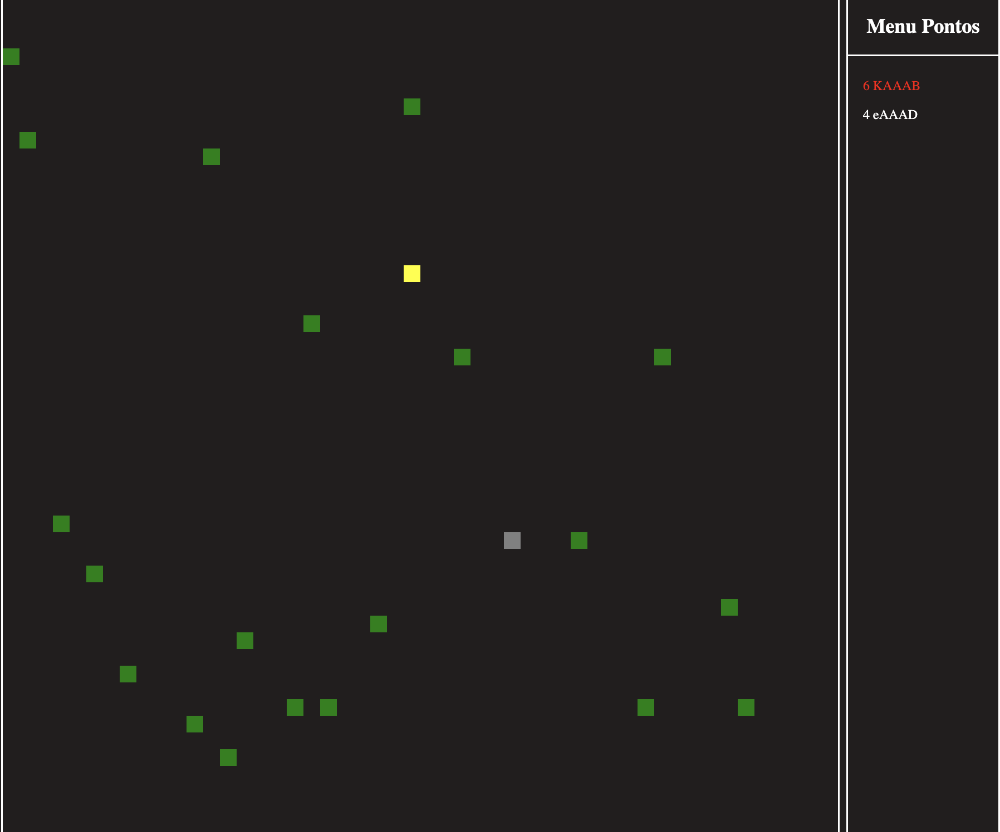

# Jogo Multiplayer com Camadas de Abstração e Stream de Dados

Esse projeto foi desenvolvido com o intuito de aprender a construir camadas de abstração utilizando stream de dados para a comunicação entre os jogadores. O jogo é um multiplayer desenvolvido em Node.js utilizando a biblioteca Express para a construção do servidor e JavaScript puro para a renderização dos elementos na tela.

## Como executar o jogo

Para executar o jogo, siga os passos abaixo:

1. Certifique-se de ter o Node.js instalado na sua máquina.
2. Baixe ou clone o repositório do jogo em sua máquina.
3. Abra um terminal na pasta do projeto.
4. Execute o comando `node install` obs( estou usando a versão 16.15.1 do nodejs) 
5. Execute o script de inicialização do servidor com o comando `npm run dev`.
6. Abra o navegador e acesse o endereço `http://localhost:3001` para jogar o game.

## Funcionamento do jogo

O jogo é um multiplayer em tempo real onde os jogadores devem comer a maça e quem fizer mais ponto ganha. Os jogadores se comunicam utilizando stream de dados e as camadas de abstração implementadas no projeto garantem uma melhor organização do código e facilidade de manutenção.

Esperamos que esse projeto seja útil para quem deseja aprender sobre camadas de abstração e stream de dados em aplicações Node.js. Sinta-se à vontade para explorar o código e modificar o jogo de acordo com suas necessidades.

